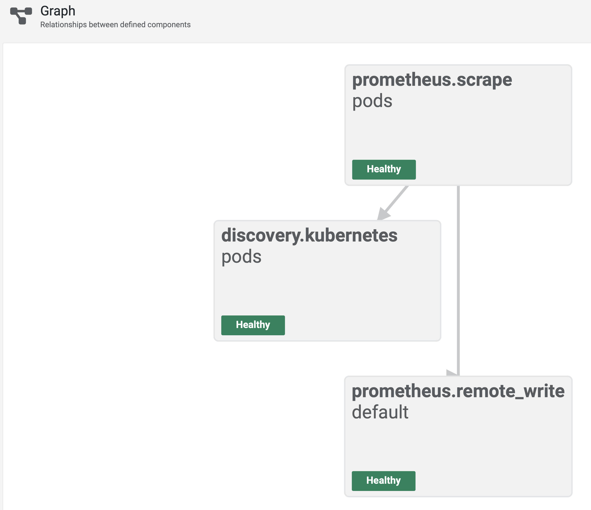

== Grafana Agent Flow on K8S

=== Concept

image:images/monitoring.png[align="center"]

=== Prerequisites

Create a separate namespace called `ga`.
[source,shell]
----
kubectl create namespace ga
----


=== Components role and installation

==== Grafana Agent in `flow` mode

https://grafana.com/docs/agent/latest/flow/get-started/install/kubernetes/[Installation docs]

Grafana Agent acts as a proxy between individual PODs that exposes metrics in Prometheus format and Prometheus database. It watches K8S environment for changes in terms of number and configuration of running PODs and scrapes metrics from them.  Then, using Prometheus DB `remote write` capability, it forwards metrics to the target storage.

Before forwarding metrics to Prometheus DB, Grafana Agent is adding additional tag to each of them, so they are distinguishable in terms of POD instances.

Grafana Agent installation process.

.Installation using https://grafana.github.io/helm-charts[Grafana Community Kubernetes Helm Charts]
[source,shell]
----
helm repo add grafana https://grafana.github.io/helm-charts
helm repo update

helm install -n ga grafana-agent-flow grafana/grafana-agent

helm list -n ga
# should list a grafana-agent-flow
----

.Port forwarding
[source,shell]
----
export POD_NAME=$(kubectl get pods --namespace ga -l "app.kubernetes.io/instance=grafana-agent-flow" -o jsonpath="{.items[0].metadata.name}")
kubectl --namespace ga port-forward $POD_NAME 8888:80
----


==== Simple apps that supply metrics on port `8080`.

Simple apps act as a metrics source for Grafana Agent. They are build using 2 different frameworks and exposes metrics in a slightly different way.

Using helm chart defined in `charts/metrics-app` and `helm-overrides.yaml` files defined in a project-level folders, we could deploy Spring Boot and Quarkus apps.

.Example helm deployment for `MetricsAppQuarkus`
[source,shell]
----
helm install -n ga demo-app-quarkus ../charts/demo-metrics-app-0.0.1.tgz -f ./helm-overrides.yaml
# -- or --
cd MetricsAppQuarkus
make helm-install
----

Both applications serve metrics but using different URL paths.


|===
|App |K8S labels |Port |Prometheus metrics path

|MetricsApp `Quarkus`
|app=metrics-app, type=quarkus
|8080
|/q/metrics

|MetricsApp `Spring`
|app=metrics-app, type=spring
|8080
|/actuator/prometheus

|===

Port forwarding is useful to see the metrics exposed by individual PODs.

.Example port forwarding for spring app using labels to distinguish PODs
[source,shell]
----
export POD_NAME=$(kubectl get pods -n ga -l "app=metrics-app,type=spring" -o jsonpath="{.items[0].metadata.name}")
kubectl -n ga port-forward $POD_NAME 8080
----

Grafana Agent should watch configured K8S namespace and automatically scrape metrics from each pod individually. Hence, after changing the number of PODs, we should see different number of metrics targets.

.Example scaling up for Quarkus app
[source,shell]
----
kubectl -n ga get deployment
kubectl -n ga scale deployment demo-metrics-app-quarkus --replicas=3
----

==== Prometheus

Prometheus acts as a target database for metrics. It is configured to enable `remote write` feature, so Grafana Agent is able to forward scraped metrics.

[source,shell]
----
helm repo add prometheus-community https://prometheus-community.github.io/helm-charts
helm repo update

helm install -n ga prometheus prometheus-community/prometheus
# --or--
helm install --namespace ga  -f ./config/prometheus/prometheus.yaml prometheus prometheus-community/prometheus

helm -n ga list
----

The built-in remote write receiver can be enabled by setting the `--web.enable-remote-write-receiver` command line flag. When enabled, the remote write receiver endpoint is `/api/v1/write`.

.Prometheus config overrides
[source,yaml]
----
include::config/prometheus/prometheus.yaml[]
----

.Port forwarding for Prometheus
[source,shell]
----
export POD_NAME=$(kubectl get pods --namespace ga -l "app.kubernetes.io/name=prometheus,app.kubernetes.io/instance=prometheus" -o jsonpath="{.items[0].metadata.name}")
kubectl --namespace ga port-forward $POD_NAME 9090
----


.Tear down prometheus installation
[source,shell]
----
helm uninstall -n ga prometheus
----

=== Grafana Agent configuration

https://grafana.com/docs/agent/latest/flow/tasks/configure/configure-kubernetes/[Official config guide]

Grafana Agent consists of 3 parts:

* prometheus scraping
* K8S discovery
* prometheus remote write

.Components for the simplest configuration


All of these components are configured in a single file/config map that is defined in Grafana Agent Helm Chart `values.yaml` by `agent.configMap.content` variable.


.Customized config map with 2 scraping targets
[source,yaml]
----
include::../../../../GrafanaAgentConfig/values-override.yaml[]
----

.Check new values in action
[source,shell]
----
helm upgrade -n ga grafana-agent-flow grafana/grafana-agent -f ./config/ga/values.yaml
----


=== Demo and debugging

.Debug POD inside the cluster
[source,shell]
----
kubectl run -it --rm --restart=Never -n ga testing --image=macieklesniak/testing-env:latest bash
----

.Simple metrics to trace
```
jvm_classes_loaded_classes
```

image::images/image-2024-09-17-12-09-04-412.png[]

image::images/image-2024-09-17-12-08-12-371.png[]

image::images/image-2024-09-17-12-07-42-234.png[]

// [source,shell]
// ----
// sudo systemctl stop firewalld
// ----
